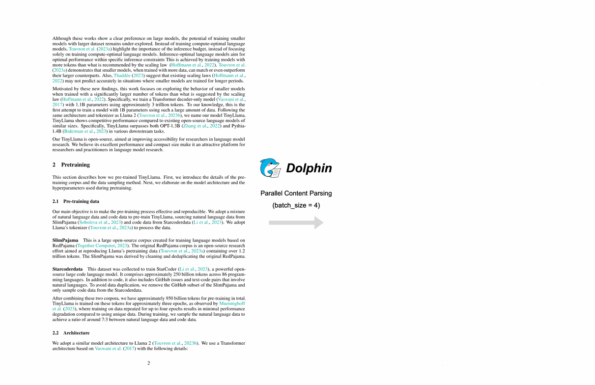
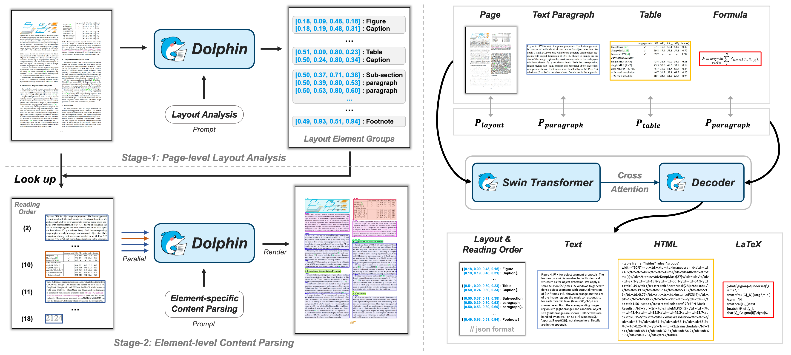

<div align="center">
  
</div>

<div align="center">
  <a href="https://arxiv.org/abs/2505.14059">
    
  </a>
  <a href="https://huggingface.co/ByteDance/Dolphin">
    
  </a>
  <a href="https://modelscope.cn/models/ByteDance/Dolphin">
    
  </a>
  <a href="https://huggingface.co/spaces/ByteDance/Dolphin">
    
  </a>
  <a href="https://github.com/bytedance/Dolphin">
    
  </a>
  <a href="https://opensource.org/licenses/MIT">
    
  </a>
  <br>
</div>

<br>

<div align="center">
  
</div>

# Dolphin: 基于异构锚点提示的文档图像解析

Dolphin（**Do**cument Image **P**arsing via **H**eterogeneous Anchor Prompt**in**g）是一个创新的多模态文档图像解析模型，采用"分析-解析"的两阶段范式。本仓库包含Dolphin的演示代码和预训练模型。

## 📑 概述

由于文档图像中文本段落、图表、公式和表格等元素的复杂交织，文档图像解析具有挑战性。Dolphin通过两阶段方法解决这些挑战：

1. **🔍 第一阶段**：通过按自然阅读顺序生成元素序列进行全面的页面级布局分析
2. **🧩 第二阶段**：使用异构锚点和任务特定提示高效并行解析文档元素

<div align="center">
  
</div>

Dolphin在多样化的页面级和元素级解析任务中取得了优异的性能，同时通过其轻量级架构和并行解析机制确保了卓越的效率。

## 🚀 演示
在 [Demo-Dolphin](http://115.190.42.15:8888/dolphin/) 上试用我们的演示。

## 📅 更新日志
- 🔥 **2025.06.30** 新增[TensorRT-LLM](https://github.com/bytedance/Dolphin/blob/master/deployment/tensorrt_llm/ReadMe.md)支持，提升推理速度！
- 🔥 **2025.06.27** 新增[vLLM](https://github.com/bytedance/Dolphin/blob/master/deployment/vllm/ReadMe.md)支持，提升推理速度！
- 🔥 **2025.06.13** 新增多页PDF文档解析功能。
- 🔥 **2025.05.21** 我们的演示已在 [链接](http://115.190.42.15:8888/dolphin/) 发布。快来体验吧！
- 🔥 **2025.05.20** Dolphin的预训练模型和推理代码已发布。
- 🔥 **2025.05.16** 我们的论文已被ACL 2025接收。论文链接：[arXiv](https://arxiv.org/abs/2505.14059)。

## 🛠️ 安装

1. 克隆仓库：
   ```bash
   git clone https://github.com/ByteDance/Dolphin.git
   cd Dolphin
   ```

2. 安装依赖：
   ```bash
   pip install -r requirements.txt
   ```

3. 使用以下选项之一下载预训练模型：

   **选项A：原始模型格式（基于配置文件）**
   
   从 [百度网盘](https://pan.baidu.com/s/15zcARoX0CTOHKbW8bFZovQ?pwd=9rpx) 或 [Google Drive](https://drive.google.com/drive/folders/1PQJ3UutepXvunizZEw-uGaQ0BCzf-mie?usp=sharing) 下载，并将其放在 `./checkpoints` 文件夹中。

   **选项B：Hugging Face模型格式**
   
   访问我们的Huggingface [模型卡片](https://huggingface.co/ByteDance/Dolphin)，或通过以下方式下载模型：
   
   ```bash
   # 从Hugging Face Hub下载模型
   git lfs install
   git clone https://huggingface.co/ByteDance/Dolphin ./hf_model
   # 或使用Hugging Face CLI
   huggingface-cli download ByteDance/Dolphin --local-dir ./hf_model
   ```

## ⚡ 推理

Dolphin提供两个推理框架，支持两种解析粒度：
- **页面级解析**：将整个文档页面解析为结构化的JSON和Markdown格式
- **元素级解析**：解析单个文档元素（文本、表格、公式）

### 📄 页面级解析

#### 使用原始框架（基于配置文件）

```bash
# 处理单个文档图像
python demo_page.py --config ./config/Dolphin.yaml --input_path ./demo/page_imgs/page_1.jpeg --save_dir ./results

# 处理单个文档PDF
python demo_page.py --config ./config/Dolphin.yaml --input_path ./demo/page_imgs/page_6.pdf --save_dir ./results

# 处理目录中的所有文档
python demo_page.py --config ./config/Dolphin.yaml --input_path ./demo/page_imgs --save_dir ./results

# 使用自定义批次大小进行并行元素解码
python demo_page.py --config ./config/Dolphin.yaml --input_path ./demo/page_imgs --save_dir ./results --max_batch_size 8
```

#### 使用Hugging Face框架

```bash
# 处理单个文档图像
python demo_page_hf.py --model_path ./hf_model --input_path ./demo/page_imgs/page_1.jpeg --save_dir ./results

# 处理单个文档PDF
python demo_page_hf.py --model_path ./hf_model --input_path ./demo/page_imgs/page_6.pdf --save_dir ./results

# 处理目录中的所有文档
python demo_page_hf.py --model_path ./hf_model --input_path ./demo/page_imgs --save_dir ./results

# 使用自定义批次大小进行并行元素解码
python demo_page_hf.py --model_path ./hf_model --input_path ./demo/page_imgs --save_dir ./results --max_batch_size 16
```

### 🧩 元素级解析

#### 使用原始框架（基于配置文件）

```bash
# 处理单个表格图像
python demo_element.py --config ./config/Dolphin.yaml --input_path ./demo/element_imgs/table_1.jpeg --element_type table

# 处理单个公式图像
python demo_element.py --config ./config/Dolphin.yaml --input_path ./demo/element_imgs/line_formula.jpeg --element_type formula

# 处理单个文本段落图像
python demo_element.py --config ./config/Dolphin.yaml --input_path ./demo/element_imgs/para_1.jpg --element_type text
```

#### 使用Hugging Face框架

```bash
# 处理单个表格图像
python demo_element_hf.py --model_path ./hf_model --input_path ./demo/element_imgs/table_1.jpeg --element_type table

# 处理单个公式图像
python demo_element_hf.py --model_path ./hf_model --input_path ./demo/element_imgs/line_formula.jpeg --element_type formula

# 处理单个文本段落图像
python demo_element_hf.py --model_path ./hf_model --input_path ./demo/element_imgs/para_1.jpg --element_type text
```

## 🌟 主要特性

- 🔄 基于单一VLM的两阶段分析-解析方法
- 📊 在文档解析任务上的优异性能
- 🔍 自然阅读顺序元素序列生成
- 🧩 针对不同文档元素的异构锚点提示
- ⏱️ 高效的并行解析机制
- 🤗 支持Hugging Face Transformers，便于集成

## 📮 通知
**征集不良案例：** 如果您遇到模型表现不佳的案例，我们非常欢迎您在issue中分享。我们正在持续优化和改进模型。

## 💖 致谢

我们要感谢以下开源项目为本工作提供的灵感和参考：
- [Donut](https://github.com/clovaai/donut/)
- [Nougat](https://github.com/facebookresearch/nougat)
- [GOT](https://github.com/Ucas-HaoranWei/GOT-OCR2.0)
- [MinerU](https://github.com/opendatalab/MinerU/tree/master)
- [Swin](https://github.com/microsoft/Swin-Transformer)
- [Hugging Face Transformers](https://github.com/huggingface/transformers)

## 📝 引用

如果您在研究中发现此代码有用，请使用以下BibTeX条目。

```bibtex
@article{feng2025dolphin,
  title={Dolphin: Document Image Parsing via Heterogeneous Anchor Prompting},
  author={Feng, Hao and Wei, Shu and Fei, Xiang and Shi, Wei and Han, Yingdong and Liao, Lei and Lu, Jinghui and Wu, Binghong and Liu, Qi and Lin, Chunhui and others},
  journal={arXiv preprint arXiv:2505.14059},
  year={2025}
}
```

## 星标历史

[](https://www.star-history.com/#bytedance/Dolphin&Date) 
